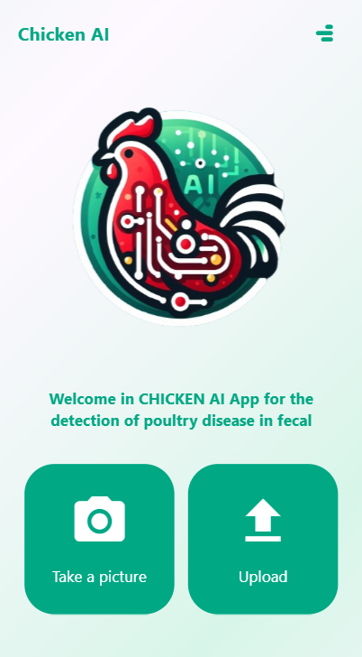

# Poultry Disease Detection App


This mobile application detects poultry diseases from images of poultry fecal matter. It uses advanced image processing techniques and machine learning algorithms to provide accurate diagnoses, helping poultry farmers manage and maintain the health of their flocks.

## Features

- **Disease Detection:** Identify various poultry diseases based on fecal images.
- **User-Friendly Interface:** Easy-to-use interface for uploading and analyzing images.
- **Real-Time Analysis:** Get results in real-time.
- **Offline Mode:** Works without an internet connection after initial setup.
- **High Accuracy:** Utilizes a TensorFlow Lite model trained with 6000 images using the DenseNet architecture, achieving 98% accuracy.

## Screenshots

<p align="center">
  
  
</p>

## Download

You can download the APK file for the application from the link below:

[Download APK](app-release.apk)

## Installation

To install and run this Flutter application, follow these steps:

1. Clone the repository:
    ```sh
    git clone https://github.com/oualidrouabah/poultry-disease-detection.git
    ```
2. Navigate to the project directory:
    ```sh
    cd poultry-disease-detection
    ```
3. Ensure you have Flutter installed. If not, follow the instructions [here](https://flutter.dev/docs/get-started/install).
4. Get the dependencies:
    ```sh
    flutter pub get
    ```
5. Run the application:
    ```sh
    flutter run
    ```

## Usage

1. Open the application on your mobile device.
2. Take a picture of the poultry fecal matter or upload an existing image.
4. View the diagnosis and suggested actions.

## Contributing

We welcome contributions from the community. To contribute:

1. Fork the repository.
2. Create a new branch:
    ```sh
    git checkout -b feature/your-feature-name
    ```
3. Make your changes.
4. Commit your changes:
    ```sh
    git commit -m 'Add some feature'
    ```
5. Push to the branch:
    ```sh
    git push origin feature/your-feature-name
    ```
6. Open a pull request.

## License

This project is licensed under the Creative Commons Attribution-NonCommercial 4.0 International License. See the [LICENSE](LICENSE) file for details.

---

Feel free to reach out if you have any questions or need further assistance!

**Contact Information:**

- Email: oualidrouabah56@gmail.com
- Twitter: [@yourtwitterhandle](https://twitter.com/RouabahOualid
